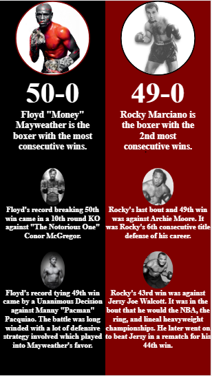

<!-- @format -->

# balance

After reading part of Andy Clarke's Art Direction for the Web I wanted to practice some of the concepts by making a similar UI to the ones presented in the book.

My interpretation of Art Directions balance UI vs the original balance UI from Art Directions::

