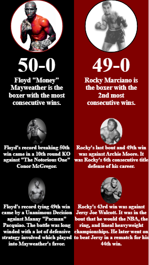
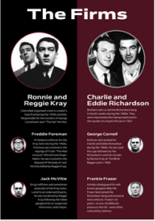

<!-- @format -->

# balance

After reading part of Andy Clarke's Art Direction for the Web I wanted to practice some of the concepts by making a similar UI to the ones presented in the book.

This particular UI is playing with the idea of balance. The interpretations chosen were making sure that the left and right side were evenly spaced since Flyod and Rocky's records were so close. The spacing and layout between images and text is also very similar in both sides.

I also chose images were both the record holders facing in the same direction, while those who were they defeated were facing in the opposite direction to create a bit of tension.

Fianlly, I chose a picture with some color for Floyd's image, so it can subtly catch the attenion of the viewer a bit more, since he is the current world record holder.

My interpretation of Art Directions balance UI vs the original balance UI from Art Directions::

